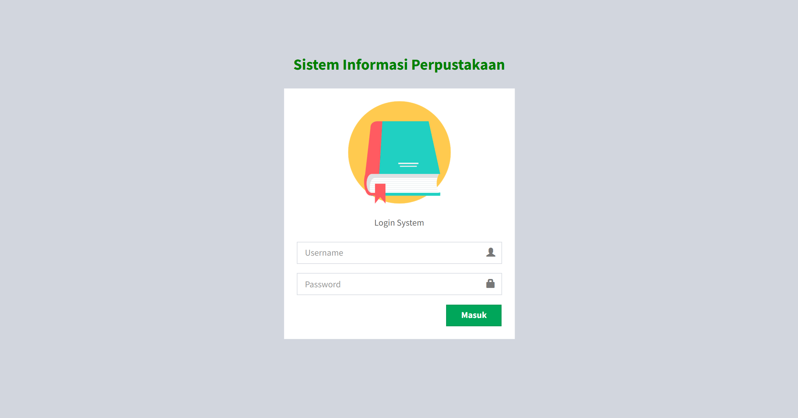
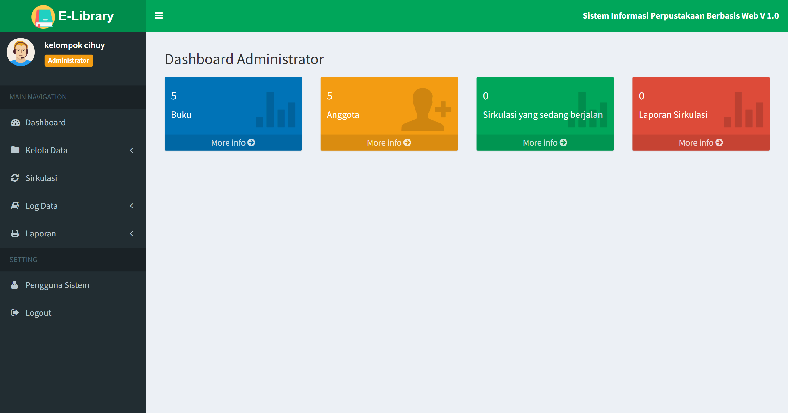
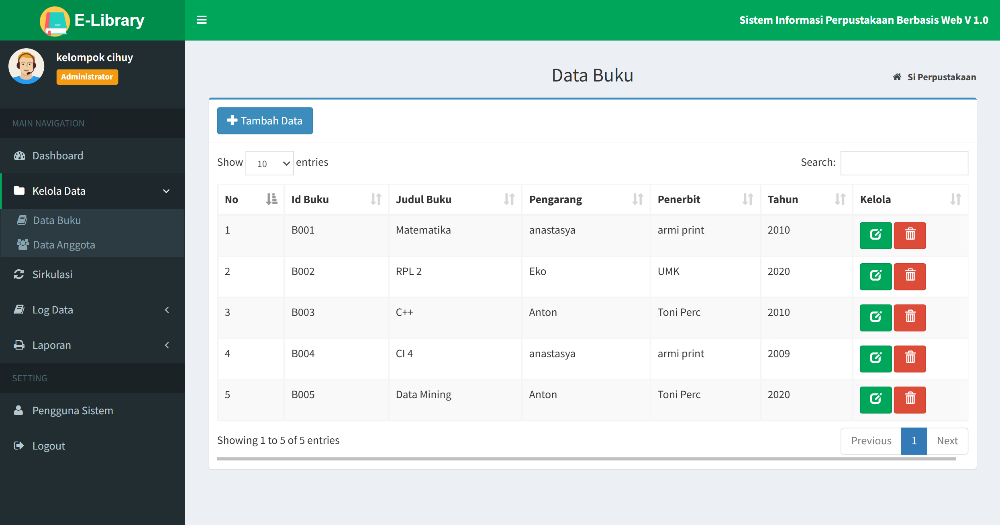
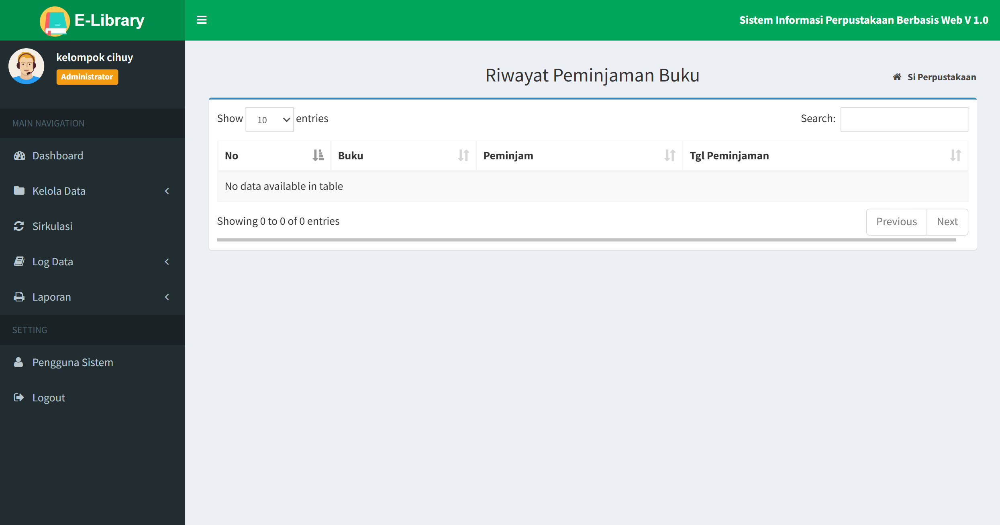
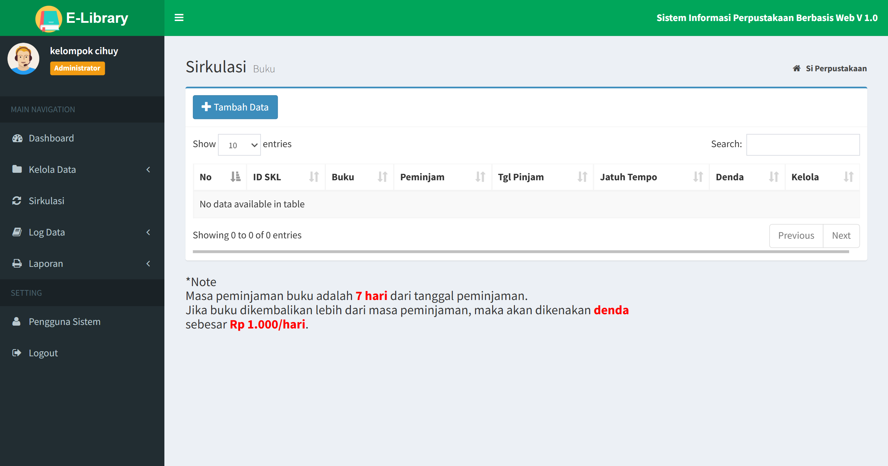
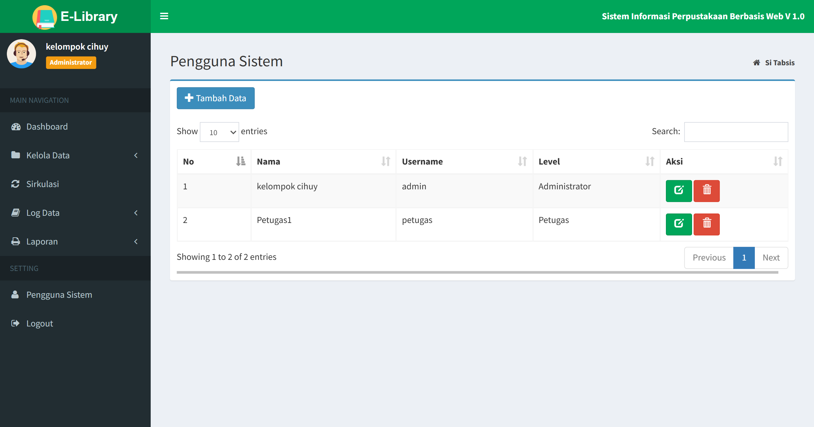
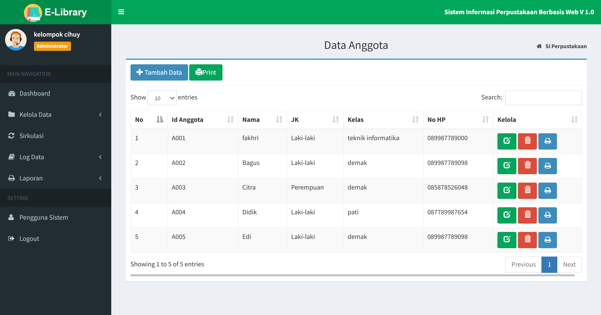

# 📚 Sistem Informasi Perpustakaan Digital

## 🧩 Deskripsi Singkat

Proyek ini bertujuan mengembangkan **Sistem Informasi Perpustakaan Digital** berbasis web untuk mempermudah pengelolaan data buku, anggota, serta transaksi peminjaman dan pengembalian. Sistem dirancang menggunakan **metode Agile (Scrum)** dengan panduan **UML Diagram** agar pengembangan lebih terstruktur dan fleksibel.

---

## 🎯 Tujuan Utama

* Mempermudah admin dalam mengelola data buku dan anggota.
* Mempercepat proses peminjaman dan pengembalian buku.
* Menyediakan laporan transaksi yang cepat dan akurat.
* Menyajikan sistem yang efisien, transparan, dan modern.

---

## ⚙️ Fitur Utama

* **Manajemen Buku:** Tambah, edit, hapus, dan pencarian buku.
* **Manajemen Anggota:** Kelola data anggota perpustakaan.
* **Transaksi:** Peminjaman & pengembalian buku otomatis dengan update status ketersediaan.
* **Laporan:** Ringkasan transaksi peminjaman dan pengembalian.
* **Login System:** Autentikasi untuk admin dan anggota.

---

## 🧱 Arsitektur & UML

Perancangan sistem menggunakan beberapa diagram UML:

* **Use Case Diagram:** Relasi antara admin, anggota, dan sistem.
* **Class Diagram:** Struktur data utama (Admin, Anggota, Buku, Peminjaman).
* **Activity Diagram & Sequence Diagram:** Alur proses sistem.

---

## 💡 Metodologi Pengembangan

Menggunakan pendekatan **Agile (Scrum)**:

1. **Product Backlog** – daftar fitur inti sistem.
2. **Sprint Planning** – pembagian tugas tiap 1–2 minggu.
3. **Sprint Execution** – pengembangan bertahap per modul.
4. **Daily Meeting** – evaluasi harian tim.
5. **Sprint Review & Retrospective** – pengujian dan perbaikan tiap sprint.

---

## 🧾 Analisis Kelayakan

| Aspek            | Ringkasan                                           | Kesimpulan |
| ---------------- | --------------------------------------------------- | ---------- |
| Teknis           | Menggunakan PHP/Laravel atau Kotlin, database MySQL | Layak      |
| Ekonomi          | Investasi rendah, manfaat tinggi                    | Layak      |
| Operasional      | Mudah digunakan dan dilatih cepat                   | Layak      |
| Hukum & Keamanan | Data terenkripsi dan sesuai regulasi                | Layak      |

---

## 💰 Estimasi Anggaran

| Komponen                 |   Estimasi (Rp) |
| ------------------------ | --------------: |
| Analisis & Desain Sistem |       1.500.000 |
| Pengembangan (Coding)    |       3.000.000 |
| Database & Hosting       |       1.200.000 |
| Domain & SSL             |         600.000 |
| Pelatihan & Testing      |       1.700.000 |
| Dokumentasi              |         500.000 |
| **Total Estimasi**       | **≈ 8.500.000** |

---

## 🧩 Teknologi yang Digunakan

* **Frontend:** HTML, CSS, JavaScript
* **Backend:** PHP (Laravel) / Kotlin
* **Database:** MySQL
* **Framework:** Agile (Scrum)
* **UML Tools:** Visual Paradigm / Draw.io

---

## 📅 Jadwal Implementasi (Sprint)

| Sprint | Modul                      | Durasi   |
| ------ | -------------------------- | -------- |
| 1      | Login & Dashboard Admin    | 2 minggu |
| 2      | Modul Manajemen Buku       | 2 minggu |
| 3      | Modul Anggota & Peminjaman | 2 minggu |
| 4      | Modul Laporan & Testing    | 2 minggu |

---

## 🧭 Kesimpulan

Sistem Informasi Perpustakaan Digital ini dirancang untuk meningkatkan efisiensi, akurasi, dan transparansi dalam pengelolaan perpustakaan. Melalui pendekatan **Agile** dan **perancangan UML**, proyek ini memastikan sistem mudah dikembangkan, diuji, dan dipelihara untuk mendukung transformasi digital di lingkungan akademik.

---

* Tampilan Login

Login dengan
username : admin
password : 123

* Tampilan Dashboard

 
* Tampilan Data Buku

* Tampilan pinjam buku

* Tampilan kembali buku

* Tampilan Sirkulasi

* Tampilan pengguna

* Tampilan Data Anggota

